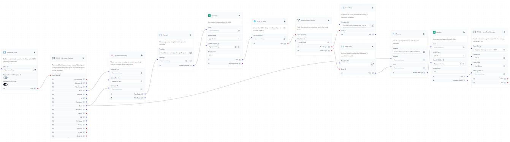

# WAHA Components for Langflow 

This is a collection of a few components that I've made for Langflow. While testing WAHA, still a Work in Progress. 

Just make sure you have a WAHA instance running.  

You can quickly spin up a WAHA instance using Docker. 

```bash
docker run -it -d --rm -p 3000:3000/tcp --name waha devlikeapro/waha
```

Here are a few components we have so far. 
1. WAHA - Get Chat Messages:
   
   This component retrieves messages from a specific chat in the WAHA API. It allows you to fetch a certain number of messages, optionally download media, and filter messages based on the sender.

2. WAHA - Get Chats:
   
   This component retrieves a list of chats from the WAHA API. It allows you to specify the number of chats to retrieve and provides pagination support through an offset parameter.

3. WAHA - Get All Contacts:
   
   This component fetches all contacts from the WAHA API. It provides a comprehensive list of all contacts associated with the WhatsApp account.

4. WAHA - React to Message:
   
   This component allows you to react to a specific message with an emoji using the WAHA API. It takes the message ID and the emoji reaction as inputs.

5. WAHA - Send Text Message:
   
   This component sends a text message to a specific chat using the WAHA API. It allows you to specify the chat ID, the message text, and optionally, a message ID to reply to.

6. WAHA Message Parser:
   
   While not explicitly a WAHA API component, this custom component parses the incoming WhatsApp message data from the WAHA API. It extracts various fields like message ID, timestamp, sender, body, etc., making it easier to work with the message data in the flow.


Here's a simple flow that I was testing with a conditional router to reply to a specific message from a specific contact. 



1. Webhook Input:
   The flow starts with a Webhook component that receives incoming data, likely from the WAHA API when a new message arrives.

2. Message Parsing:
   The incoming data is then passed to the WAHA Message Parser, which extracts relevant information from the message.

3. Conditional Routing:
   A Conditional Router checks the parsed message, likely to determine if it requires a response.

4. Response Generation:
   If a response is needed, the flow splits into two paths:
   a) One path uses a Prompt and an OpenAI model to generate a response.
   b) Another path uses a series of components including Prompts, OpenAI and Anthropic models to generate a more complex response.

5. Boolean Decision:
   The more complex path includes a Data Boolean Splitter, which makes a decision based on some criteria in the generated response.

6. Message Sending:
   Both paths eventually lead to a WAHA - Send Text Message component, which sends the generated response back to the WhatsApp chat.

7. Historical Context:
   There's also a WAHA - Get Chat Messages component that likely retrieves previous messages to provide context for response generation.
